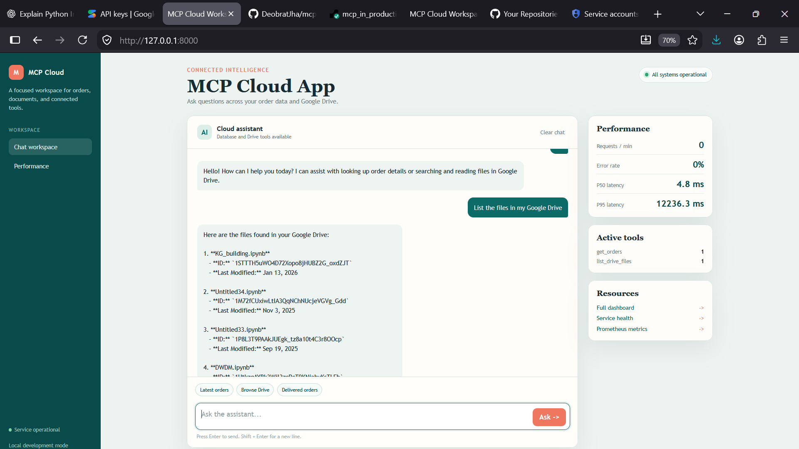

# MCP Cloud App

A single FastMCP application with:

- Google ADK chat
- SQLite order tools
- Google Drive read-only tools
- Performance dashboard
- Prometheus metrics

## Local Setup

```powershell
python -3.12 -m venv .venv
.\.venv\Scripts\Activate.ps1
pip install -r requirements.txt
```

Create a `.env` file:

```env
GOOGLE_API_KEY=your_gemini_api_key
GEMINI_MODEL=gemini-2.5-flash
GOOGLE_SERVICE_ACCOUNT_JSON={"type":"service_account"}
GOOGLE_DRIVE_FOLDER_ID=your_drive_folder_id
```

Share the Google Drive folder with the service-account email and enable the Google Drive API.

## Run

```powershell
python -m uvicorn cloud_app:app --host 0.0.0.0 --port 8000
```


## Render

Build command:

```text
pip install -r requirements.txt
```

Start command:

```text
uvicorn cloud_app:app --host 0.0.0.0 --port $PORT
```


## Project Demo

<p align="center">
  
</p>